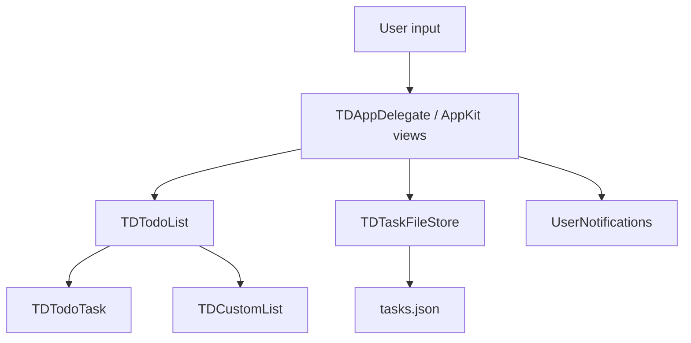

# Architecture

TodoDesk is a small native macOS app with a deliberately simple build. It uses Objective-C, AppKit, Foundation, and shell scripts instead of an Xcode project or package manager.

## Runtime Shape



## Modules

`Sources/TodoDeskCore/` contains the domain layer:

- `TDTodoTask`: task entity, JSON representation, optional fields for due date, completion date, parent task, estimated minutes, and description.
- `TDCustomList`: custom list entity and JSON representation.
- `TDTodoList`: task collection behavior, tab filtering, sorting, subtasks, rename/delete, completion, estimated time, description updates, custom lists, and daily review behavior.
- `TDTaskFileStore`: JSON loading/saving, legacy migration, default data path, and `TODODESK_STORE_PATH` override.
- `TDTimeFormatting`: user-facing countdown text.

`Sources/TodoDeskApp/` contains the AppKit layer:

- `main.m`: starts `NSApplication`.
- `TDAppDelegate`: window construction, menus, tabs, bottom add-task controls, search, timers, notifications, persistence, keyboard shortcuts, drag-and-drop, import/export, and dialogs.
- `TDTaskCellView`: compact task row rendering, estimate/timer/completion/description text, disclosure state, and pencil button.
- `TDTaskTableView`: keyboard event routing for delete, rename, timer toggle, focus add field, and tab switching.

## Data Model

The current persisted JSON shape is:

```json
{
  "version": 2,
  "lists": [],
  "tasks": []
}
```

Each task stores stable identifiers and optional metadata. Today/tomorrow/history behavior is based on `bucket` plus `dueDate`. Custom list tasks use `bucket: "custom"` plus `listID` and normally keep `dueDate` as `null`.

Subtasks are one level in the UI. If a subtask is used as the parent for a new subtask, the new item is added under the root parent so the display remains flat and predictable.

## Storage

By default:

```text
~/Library/Application Support/TodoDesk/tasks.json
```

For development and automated QA:

```bash
TODODESK_STORE_PATH=/tmp/tododesk-qa.json open .build/TodoDesk.app
```

The app menu includes `檔案 > 打開資料夾` to reveal the active storage folder.

## UI Layout Rules

Task rows are intentionally compact. The table row height is fixed at 82 points. `TDTaskCellView` appends estimate, completion time, and description into the title line so adding a description or completion timestamp does not create a new row or resize the block.

The bottom add-task flow is:

1. task title
2. hours
3. minutes
4. add button
5. back to task title

This is controlled by `configureAddTaskKeyLoop` in `TDAppDelegate`.

The pencil button opens the task details flow. It should work for both main tasks and subtasks, and should allow editing description plus estimated hours/minutes.

## Date And Time Rules

TodoDesk uses a Gregorian calendar with `NSTimeZone.localTimeZone` in the running app. Tests use a fixed Hong Kong calendar so date boundary behavior is deterministic.

The app supports a configurable "today cutoff" time. Core date logic lives in `TDTodoList`, especially `activeDayStartForDate:calendar:todayCutoffMinutes:` and `dayStartForDate:offset:calendar:todayCutoffMinutes:`.

## Build

`scripts/build-app.sh` compiles core and app sources with:

- `clang`
- `-fobjc-arc`
- `-Wall -Wextra -Werror`
- Cocoa, QuartzCore, UniformTypeIdentifiers, and UserNotifications frameworks

The script writes the app bundle to:

```text
.build/TodoDesk.app
```

It also writes `Info.plist`, `PkgInfo`, copies `Assets/AppIcon.icns`, clears extended attributes, and ad-hoc signs the app for local use.

## Tests

`make test` runs `scripts/test.sh`, which compiles a standalone Foundation test binary using the core sources and `Tests/TodoDeskCoreTests/TodoDeskCoreTests.m`.

Core behavior should be covered there when practical. AppKit-only behavior may require manual QA until an automated UI harness is added.
